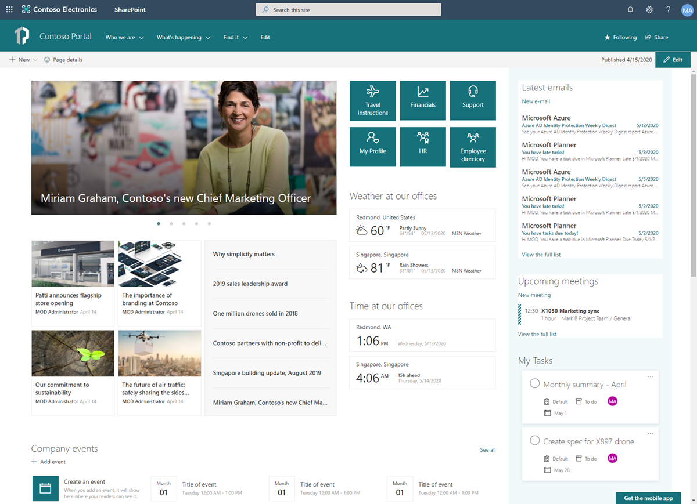
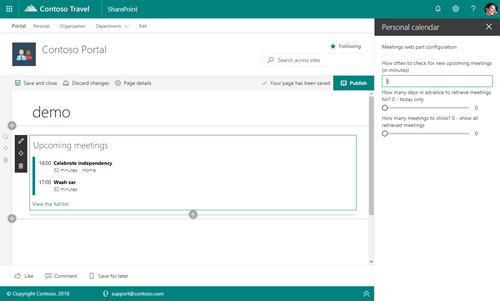
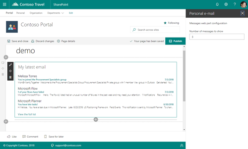
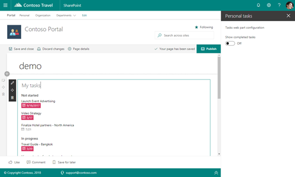
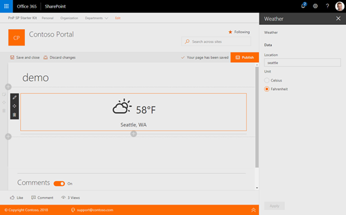
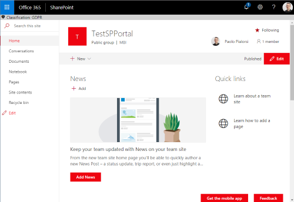

# SharePoint Starter Kit v2

The SharePoint Starter Kit (starter kit) is a comprehensive solution designed for SharePoint Online and SharePoint 2019 which provides numerous SharePoint Framework (SPFx) web parts, extensions, and other components, as well as [PnP PowerShell](https://github.com/pnp/pnp-powershell) driven provisioning which you can use as an example and inspiration for your own customizations. 



> Starter Kit Version 1 includes a comprenshive strategy for only SharePoint Online, as well as a single SPFx solution that encapsulates all webparts and extensions into a single package. Version 1 may be accessed via the [v1 branch](https://github.com/SharePoint/sp-starter-kit/tree/v1) for legacy purposes and will not be maintained beyond April 2020.

> Notice: There currently **is not** a direct path for upgrading an existing SharePoint Online tenant with the starter kit v1 to v2. V2 may be installed into a tenant with v1 already installed, by default, this will add a tenant wide duplicate all of webparts and extensions. It is recommended that the starter kit v1 be removed from a tenant before adding v2, or creating a custom installation of v2.

> Notice: the starter kit adds **tenant level settings** including themes, site designs, taxonomy term sets, and other adjustments. Therefore, it is recommended to test the starter kit in an **isolated test tenant and not immediately execute it within your production environment**.


## Objectives of this solution

SharePoint Communication Sites and Team Sites have great out-of-the-box capabilities, although the out-of-the-box capabilities may not always be sufficient for your scenarios. This is exactly why SharePoint may be extended and you are able to include your own customizations. This solution addresses common scenarios and tasks you may encounter when introducing those customizations, and provides examples and guidance on how you might address and provision them including:

- Automated provisioning of simple demo content within a communication site
- Automated provisioning of multiple team sites with pre-configuration and hub site association
- Automated provisioning of the whole solution to any tenant within minutes
- Automated configuration of Site Scripts and Site Designs at the tenant level using the PnP Remote Provisioning engine (SharePoint Online only)
- Implementation of different customizations for SharePoint
- Usage of Office UI Fabric and reusable PnP SPFx controls within the customizations

> Additional high resolution screenshots are also available: [front page](./assets/images/high-res-default-home-page-contoso.png).


## SharePoint Starter Kit v2 has following objectives

* Extend the success of v1 by providing developers a customization and provisioning strategy for SharePoint
* Demonstrate new SharePoint Online UX design and layout capabilities - (*not yet available*)
* SharePoint 2019 compatible starter kit with web parts and components supported by SharePoint 2019 - (*not yet available*)
* Support web parts and extensions to be deployed one-by-one to tenants or farms
* Demonstrate teams tab development with SharePoint Framework for suitable web parts in SharePoint Online
* Demonstrate Microsoft Graph API and Graph Toolkit usage in SharePoint Online


## Pre-requirements

Here are current pre-requirements for making this solution work in your tenant.

- You will need to be a tenant administrator to be able to deploy this solution
    - Notice that you can get free developer tenant from [Office 365 developer program](https://developer.microsoft.com/en-us/office/dev-program), if needed.

- Automatic end-to-end provisioning only works with English tenants
    - All solutions and web parts are also English in the current implementation
    - For tenants that have English but have a different default language, the [term set provisioning may be modified to assist with installation](./documentation/term-store.md#non-english-tenants)

- Release preferences for your SharePoint Online tenant will need to be set as "Targeted release for everyone" option (also known as First Release)

- Add the tenant administrator account used during provisioning as Term Store Administrator in the Taxonomy Term Store through the SharePoint Admin Center (SPO) or Central Admin (SP2019)

- A tenant 'App Catalog' must have been created within the 'Apps' option of the SharePoint Admin Center (SPO) or Central Admin (SP2019)

> It is recommended that you wait up to 24 hours before attempting to provision this solution if any of the following are true
> - Your SharePoint tenant was just created
> - You just created your SharePoint tenant app catalog
> - You just set your tenant as "Targeted release for everyone" (SPO)


## Getting started

Shortest path to success for SharePoint Online - The following steps will help you get started in any SharePoint Online tenant as fast as possible.

> For SharePoint 2019 tenant,  [refer to the SharePoint 2019 installation instructions](./provisioning/readme-sp2019.md)

- Ensure you meet the [Pre-requirements](#Pre-requirements)

- Ensure that you meet the [requirements for SharePoint Framework development](https://docs.microsoft.com/en-us/sharepoint/dev/spfx/set-up-your-development-environment) and are using the latest version of [PnP PowerShell](https://docs.microsoft.com/en-us/powershell/sharepoint/sharepoint-pnp/sharepoint-pnp-cmdlets?view=sharepoint-ps)

- Prepare your tenant, by accomplishing the tasks highlighted in document [Preparing your tenant for the PnP SharePoint Starter Kit](./documentation/tenant-settings.md)

- Open PowerShell, and use PnP PowerShell to connect to any site in your tenant with the [`Connect-PnPOnline` cmdlet](https://docs.microsoft.com/en-us/powershell/module/sharepoint-pnp/connect-pnponline?view=sharepoint-ps) using your own tenant url

  ```powershell
  Connect-PnPOnline https://contosodemosk.sharepoint.com
  ```

- Change to the `provisioning` folder found in this solution's root and execute the following command (using your own tenant url and the prefix of your choosing):

  ```powershell
  Apply-PnPTenantTemplate -Path .\starterkit.pnp
  ```

  This will provision three site collections with urls of `/sites/demoportal`, `/sites/demohr`, and `/sites/demomarketing`. Your urls may vary depending on the managed path you selected for team sites in your tenant administration (this defaults to 'sites').

    - Refer to the ['provisioning documentation'](./provisioning) for advanced provisioning options and guidance

    - If you run into errors during provisioning, refer to ['Common SP Starter Kit Provisioning results'](./documentation/common-provision-results.md) for additional suggestions and common mistakes

- This solution will automatically install multiple SPFx webparts that require API permissisons to the Graph API. After installing this solution, access your API Management page in your SharePoint Admin Center and approve the pending requests.

> Notice that the starter kit also adds tenant level settings like themes, site designs, taxonomy term sets, and other adjustments. Therefore, it is recommended to test the starter kit in an **isolated test tenant and not immediately execute it within your production environment**.


## Learn more

- [Detailed provisioning instructions for SharePoint Online](./provisioning/readme.md)
- [Detailed provisioning instructions for SharePoint 2019](./provisioning/readme-2019.md)

## Custom Web Parts

Here are the custom web parts currently included in the solution package.

Screenshot |  Web Part |  Description  | Compatibility | Code
------------ | ----------- | ----------- | ----------- | -----------
 | [Banner](documentation/components/wp-banner.md) | Creates a banner with an image and overlaid text. | SPO / SP 2019 | [code](./source/react-banner)
 | [Followed Sites](documentation/components/wp-followed-sites.md) | Shows the list of sites which particular user is following | SPO / SP 2019 | [code](./source/react-followed-sites)
 | [Links](documentation/components/wp-links.md)  | Link list web part which is using collection data editor and stores the links in web part properties | SPO / SP 2019 | [code](./source/react-links)
 | [LOB integration](documentation/components/wp-lob-integration.md) | Sample web part to surface LOB information from API hosted in Azure. | SPO only | [code](./source/react-lob-integration)
 | [People Directory](documentation/components/wp-people-directory.md) | People directory web part uses the people search API to get list of people to show.  | SPO / SP 2019 | [code](./source/react-people-directory)
 | [Personal Calendar](documentation/components/wp-personal-calendar.md) | Shows upcoming calendar meetings for the particular user using Microsoft Graph. | SPO only | [code](./source/react-personal-calendar)
 | [Personal Contacts](documentation/components/wp-personal-contacts.md) | Personal contacts for particular user using Microsoft Graph. | SPO only |[code](./source/react-personal-contacts)
 | [Personal Email](documentation/components/wp-personal-email.md) | List latest personal emails for the current user using Microsoft Graph. | SPO only | [code](./source/react-personal-email)
 | [Personal Tasks](documentation/components/wp-personal-tasks.md) | Show personal tasks for the current user using Microsoft Graph. | SPO only | [code](./source/react-personal-tasks)
 | [Recent Contacts](documentation/components/wp-recent-contacts.md) | Show recent contacts for the current user using Microsoft Graph. | SPO only | [code](./source/react-recent-contacts)
 | [Recently Used Documents](documentation/components/wp-recently-used-documents.md) | Show recently used documents for the current user using Microsoft Graph. | SPO only | [code](./source/react-recently-used-documents)
 | [Recently Visited Sites](documentation/components/wp-recently-visited-sites.md) | Show recently visited sites for current user using Microsoft Graph. | SPO only | [code](./source/react-recently-visited-sites)
 | [Site Information](documentation/components/wp-site-information.md) | Intended to collect and present additional metadata for group associated team sites. | SPO / SP 2019 | [code](./source/react-site-information)
 | [Stock Information (deprecated)](documentation/components/wp-stock-information.md) | Display stock information by using the live stocks service provided by [Alpha Advantage](https://www.alphavantage.co/). You will need to register for a custom key for this to work at the Alpha Advantage site and then include the key in the tenant properties. | SPO ony| [code](solution/src/webparts/stockInformation/StockInformationWebPart.ts)
 | [Tiles](documentation/components/wp-tiles.md) | Renders set of tiles. Icons are from Office UI Fabric and you can configure tiles using collection editor in web part properties. | SPO / SP 2019 |[code](./source/react-tiles)
 | [Weather Information](documentation/components/wp-weather-information.md) | Weather information web part which is using Yahoo Weather APIs to get the forecast information. | SPO / SP 2019 | [code](./source/react-weather)
 | [World Time](documentation/components/wp-world-time.md) | Clock web part to show the time in specific time zone. | SPO / SP 2019 | [code](./source/react-world-clock)


## SharePoint Framework Extensions

Screenshot |  Extension |  Description  | Compatibility | Code
------------ | ----------- | ----------- | ----------- | -----------
 | [Alert Notification](documentation/components/ext-alert.md) | Shows informational or important messages in the header section of pages based on a custom list information in the hub site. | SPO / SP 2019 | [code](./source/react-application-alerts)
 | [Collaboration Footer](documentation/components/ext-collab-footer.md) | Shows company wide links which are configured using Taxonomy service. Includes also  personalized links which are stored in user profile property if set. By default associated to group associated team sites when a custom Site Design is selected for new sites. | SPO / SP 2019 | [code](./source/react-application-collab-footer)
 | [Discuss Now](documentation/components/ext-collab-discussnow.md) | Custom list view command set to add new custom dialog for document library that utilizes the Graph API. | SPO only | [code](./source/react-command-discuss-now)
 | [Portal Footer](documentation/components/ext-portal-footer.md) | Expanding footer for communication site. Show standard company links and also supports personalized links for the current user which are stored in User Profile. | SPO / SP 2019 | [code](./source/react-appication-portal-footer)
Not available | Redirect | Can be used to perform automatic redirections of URLs in the site based on a custom list. | SPO / SP 2019 | [code](./source/react-application-portal-footer)
 | [Site Classification (deprecated)](documentation/components/ext-classification.md) | Renders a header with site classification information. This has been replaced by out-of-the-box SharePoint Online header functionality | SPO only | [code](./solution/src/extensions/siteClassification/SiteClassificationApplicationCustomizer.ts)
Not available | Tab Page (deprecated) | Renders a header with links between two different pages in the site. | SPO only | [code](./solution/src/extensions/tabPage/TabPageApplicationCustomizer.ts)


## Support and SLA for this project

The following statements apply across all of the PnP samples and solutions, including samples, core component(s) and solutions, including the SharePoint Starter Kit.

- PnP guidance and samples are created by Microsoft & by the community
- PnP guidance and samples are maintained by Microsoft & by the community
- PnP uses supported and recommended techniques
- PnP is an open-source initiative by the community – people who work on the initiative for the benefit of others, have their normal day job as well
- PnP is NOT a product and therefore it’s not supported by Premier Support or other official support channels
- PnP is supported in similar ways as other open source projects offered by Microsoft with support from the community, by the community
- There are numerous partners that utilize PnP within their solutions for customers. Support for this is provided by the Partner. When PnP material is used in deployments, we recommend being clear with your customer/deployment owner on the support model

## Contributing

This project welcomes contributions and suggestions.  Most contributions require you to agree to a
Contributor License Agreement (CLA) declaring that you have the right to, and actually do, grant us
the rights to use your contribution. For details, visit https://cla.microsoft.com.

When you submit a pull request, a CLA-bot will automatically determine whether you need to provide
a CLA and decorate the PR appropriately (e.g., label, comment). Simply follow the instructions
provided by the bot. You will only need to do this once across all repos using our CLA.

This project has adopted the [Microsoft Open Source Code of Conduct](https://opensource.microsoft.com/codeofconduct/).
For more information see the [Code of Conduct FAQ](https://opensource.microsoft.com/codeofconduct/faq/) or
contact [opencode@microsoft.com](mailto:opencode@microsoft.com) with any additional questions or comments.
