# PnP SharePoint Starter Kit

This is a solution designed for SharePoint Online which provides numerous web parts, extensions, and other components which you can use as an example and inspiration for your own customizations.

> Please be aware that **documentation work is still in progress** and we will keep on provide more guidance and input around covered capabilities in this solution. In the meantime, please submit issues and questions using the [issues list](../../issues) to help us provide better documentation and guidance. Thanks for your patience!

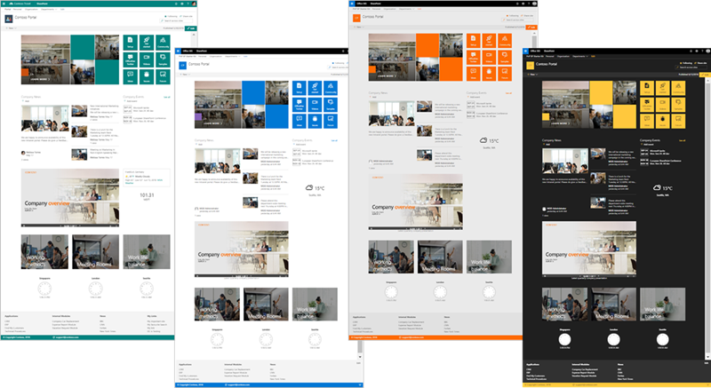

## Objectives of this solution

SharePoint Communication Sites have great out-of-the-box capabilities, but the out-of-the-box capabilities may not always be sufficient for your scenarios. This is exactly why you are able to include your own customizations. This solution addresses common scenarios and tasks you may encounter when introducing those customizations, and provides examples and guidance on how you might address them including:

- Automated provisioning of simple demo content within a communication site
- Automated provisioning of the whole solution to any tenant within minutes
- Automated configuration of Site Scripts and Site Designs at the tenant level using the PnP Remote Provisioning engine
- Implementation of different customizations for SharePoint Online
- Usage of Office UI Fabric and reusable PnP SPFx controls within the customizations

> Additional high resolution screenshots are also available: [front page](./assets/images/hihg-res-default-home-page.png) and [front page with extended footer](./assets/images/hihg-res-default-home-page-extended-footer.png).


## Pre-requirements

Here are current pre-requirements for making this solution work in your tenant.

- You will need to be a tenant administrator to be able to deploy this solution
    - Notice that you can get free developer tenant from [Office 365 developer program](https://developer.microsoft.com/en-us/office/dev-program), if needed.
- Automatic end-to-end provisioning only works with English tenants
    - All solutions and web parts are also English in the current implementation
- Release preferences for your tenant will need to be set as "Targeted release for everyone" option (also known as First Release)
- Add used tenant administrator account as Term Store Administrator in the Taxonomy Term Store 
- The tenant app catalog must have been created 


## Getting started

Minimum path to success: The following steps will help you get started in any tenant as fast as possible:

- Ensure that you meet the [requirements for SharePoint Framework development](https://docs.microsoft.com/en-us/sharepoint/dev/spfx/set-up-your-development-environment) and are using the latest version of [PnP PowerShell](https://docs.microsoft.com/en-us/powershell/sharepoint/sharepoint-pnp/sharepoint-pnp-cmdlets?view=sharepoint-ps)
- Prepare your tenant, by accomplishing the tasks highlighted in document [Preparing your tenant for the PnP SharePoint Starter Kit](./documentation/tenant-settings.md).
- Upload and deploy the [`sharepoint-starter-kit.sppkg`](./package/sharepoint-starter-kit.sppkg) from the [`/package`](./package) folder to your tenant app catalog
    - After deploying the .sppkg package to the tenant app catalog, approve the requested API permissions. [Approving third party API access](./documentation/api-management.md).
- Open PowerShell, and use PnP PowerShell to connect to any site in your tenant with the [`Connect-PnPOnline` cmdlet](https://docs.microsoft.com/en-us/powershell/module/sharepoint-pnp/connect-pnponline?view=sharepoint-ps) using your own tenant url

```powershell
Connect-PnPOnline https://contosodemosk.sharepoint.com
```

- Change to the `provisioning` folder found in SP Starter Kit solution root and execute the following command (using your own tenant url and the prefix of your choosing):
    - Refer to the ['provisioning documentation'](./provisioning) for advanced provisioning options and guidance
    - If you run into errors during provisioning, refer to ['Common SP Starter Kit Provisioning results'](./documentation/common-provision-results.md) for additional suggestions and common mistakes

```powershell
.\deploy.ps1 -TenantUrl https://contosodemosk.sharepoint.com -SitePrefix demo
```

This will provision 3 site collections with urls of `/sites/demoportal`, `/sites/demohr`, and `/sites/demomarketing`. Your urls may vary depending on the SitePrefix you use.


> Notice that this script also adds tenant level settings like themes, site designs, taxonomy term sets, and other adjustments. Therefore, it is recommended to test the script in an **isolated test tenant and not immediately execute it within your production environment**. Nevertheless, a cleanup script will come shortly.

## Custom Web Parts

Here are the custom web parts currently included in the solution package.

Pic |  Web Part |  Description  | Code
------------ | ----------- | ----------- | -----------
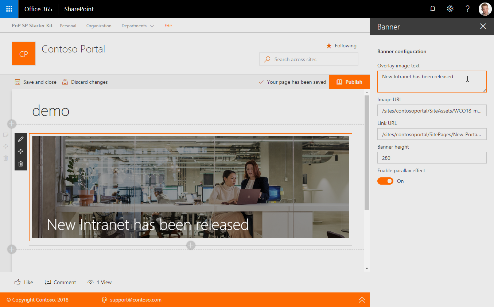 | [Banner](documentation/components/wp-banner.md) | Creates a banner with an image and overlaid text. | [code](solution/src/webparts/banner/bannerwebpart.ts)
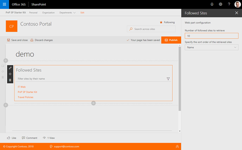 | [Followed Sites](documentation/components/wp-followed-sites.md) | Shows the list of sites which particular user is following | [code](solution/src/webparts/followedSites/FollowedSitesWebPart.ts)
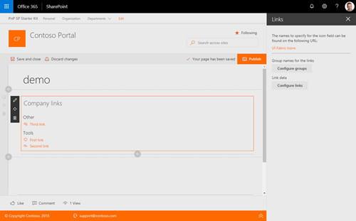 | [Links](documentation/components/wp-links.md)  | Link list web part which is using collection data editor and stores the links in web part properties | [code](solution/src/webparts/links/LinksWebPart.ts)
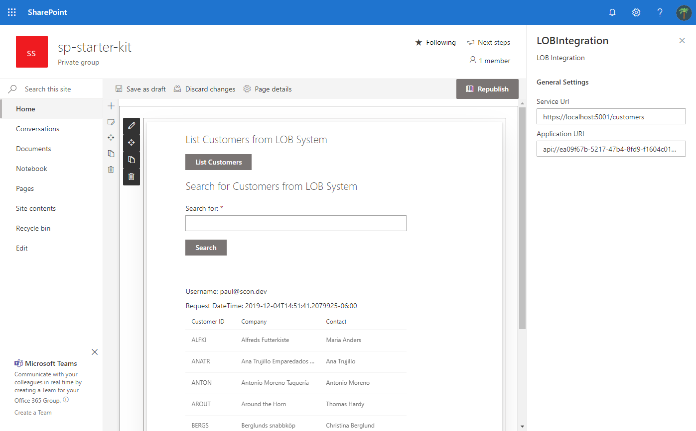 | LOB integration | Sample web part to surface LOB information from API hosted in Azure. | [code](solution/src/webparts/lobIntegration/LobIntegrationWebPart.ts)
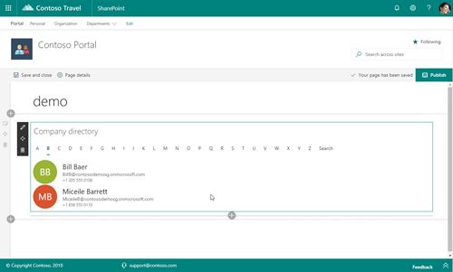 | People Directory | People directory web part uses people search API to get list of people to show.  | [code](solution/src/webparts/peopleDirectory/PeopleDirectoryWebPart.ts)
 | Personal Calendar | Shows upcoming calendar meetings for the particular user using Microsoft Graph. | [code](solution/src/webparts/personalCalendar/PersonalCalendarWebPart.ts)
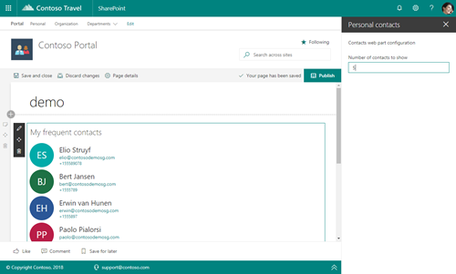 | Personal Contacts | Personal contacts for particular user using Microsoft Graph. | [code](solution/src/webparts/personalContacts/PersonalContactsWebPart.ts)
 | Personal Email | List latest personal emails for the current user using Microsoft Graph. | [code](solution/src/webparts/personalEmail/PersonalEmailWebPart.ts)
 | Personal Tasks | Show personal tasks for the current user using Microsoft Graph. | [code](solution/src/webparts/personalTasks/PersonalTasksWebPart.ts)
 | Recent Contacts | Show recent contacts for the current user using Microsoft Graph. | [code](solution/src/webparts/recentContacts/RecentContactsWebPart.ts)
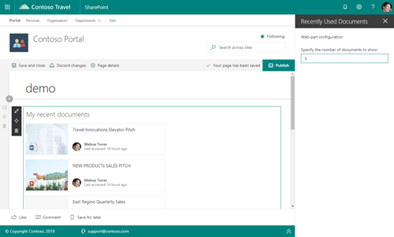 | Recently Used Documents | Show recently used documents for the current user using Microsoft Graph. | [code](solution/src/webparts/recentlyUsedDocuments/RecentlyUsedDocumentsWebPart.ts)
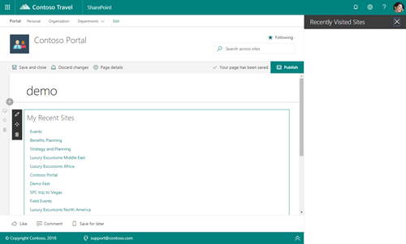 | Recently Visited Sites | Show recently visited sites for current user using Microsoft Graph. | [code](solution/src/webparts/recentlyVisitedSites/RecentlyVisitedSitesWebPart.ts)
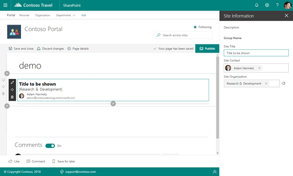 | Site Information | Intended to collect and present additional metadata for group associated team sites. | [code](solution/src/webparts/siteInformation/SiteInformationWebPart.ts)
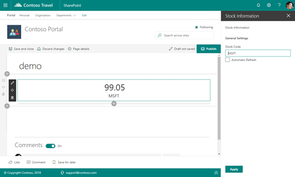 | Stock Information | uses the live stocks service provided by [Alpha Advantage](https://www.alphavantage.co/). You will need to register specific key for this to work in the Alpha Advantage site and in the tenant properties.  | [code](solution/src/webparts/stockInformation/StockInformationWebPart.ts)
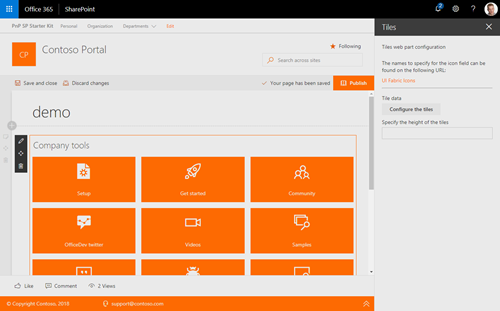 | Tiles | Renders set of tiles. Icons are from Office UI Fabric and you can configure tiles using collection editor in web part properties. | [code](solution/src/webparts/tiles/TilesWebPart.ts)
 | Weather Information | Weather information web part which is using Yahoo Weather APIs to get the forecast information. | [code](solution/src/webparts/weatherInformation/WeatherInformationWebPart.ts)
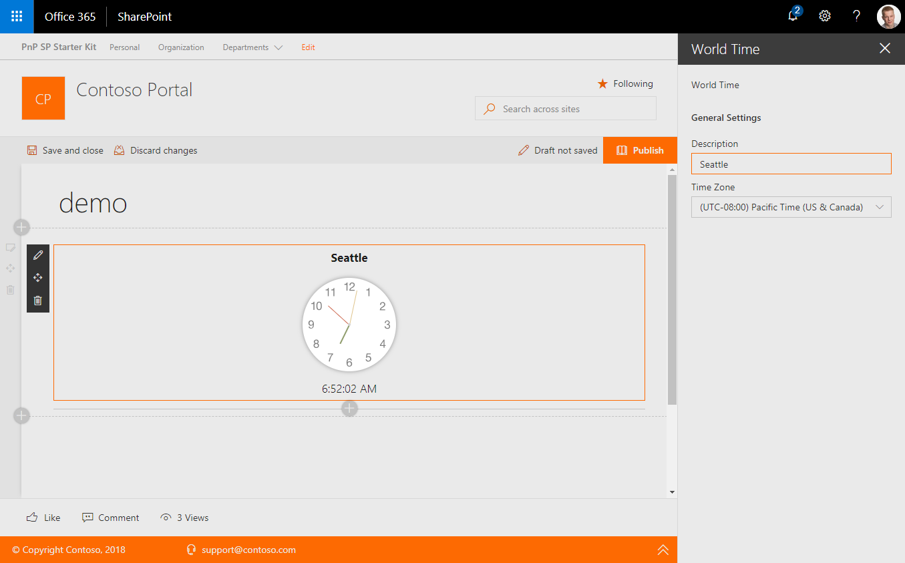 | World Time | Clock web part to show the time in specific time zone. | [code](solution/src/webparts/worldTime/WorldTimeWebPart.ts)

## SharePoint Framework Extensions

Pic |  Extension |  Description  | Code
------------ | ----------- | ----------- | -----------
 | [Alert Notification](documentation/components/ext-alert.md) | Shows informational or important messages in the header section of pages based on a custom list information in the hub site. | [code](solution/src/extensions/alertNotitication/AlertNotiticationApplicationCustomizer.ts)
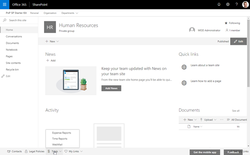 | Collaboration Footer | Shows company wide links which are configured using Taxonomy service. Includes also  personalized links which are stored in user profile property if set. By default associated to group associated team sites when a custom Site Design is selected for new sites. | [code](solution/src/extensions/collabFooter/CollabFooterApplicationCustomizer.ts)
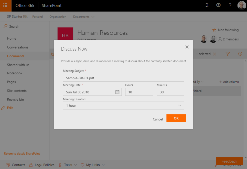 | Discuss Now | Custom list view command set to add new custom dialog for document library. | [code](solution/src/extensions/discussNow/DiscussNowCommandSet.ts)
 | Portal Footer | Expanding footer for communication site. Show standard company links and also supports personalized links for the current user which are stored in User Profile. | [code](solution/src/extensions/portalFooter/PortalFooterApplicationCustomizer.ts)
Not available | Redirect | Can be used to perform automatic redirections of URLs in the site based on a custom list. | [code](solution/src/extensions/redirect/RedirectApplicationCustomizer.ts)
 | Site Classification | Renders a header with site classification information. | [code](solution/src/extensions/siteClassification/SiteClassificationApplicationCustomizer.ts)
Not available | Tab Page | Renders a header with links between two different pages in the site. | [code](solution/src/extensions/tabPage/TabPageApplicationCustomizer.ts)

## Contributing

This project welcomes contributions and suggestions.  Most contributions require you to agree to a
Contributor License Agreement (CLA) declaring that you have the right to, and actually do, grant us
the rights to use your contribution. For details, visit https://cla.microsoft.com.

When you submit a pull request, a CLA-bot will automatically determine whether you need to provide
a CLA and decorate the PR appropriately (e.g., label, comment). Simply follow the instructions
provided by the bot. You will only need to do this once across all repos using our CLA.

This project has adopted the [Microsoft Open Source Code of Conduct](https://opensource.microsoft.com/codeofconduct/).
For more information see the [Code of Conduct FAQ](https://opensource.microsoft.com/codeofconduct/faq/) or
contact [opencode@microsoft.com](mailto:opencode@microsoft.com) with any additional questions or comments.
