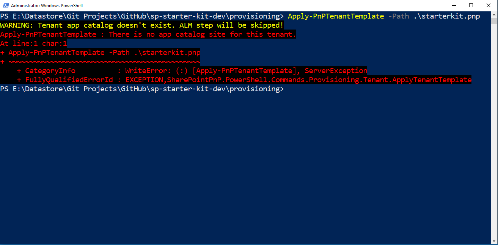
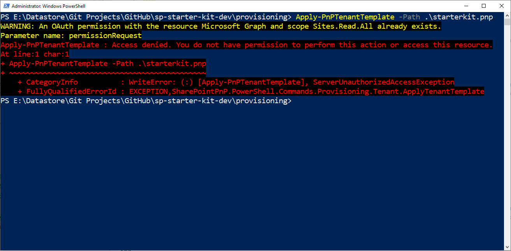
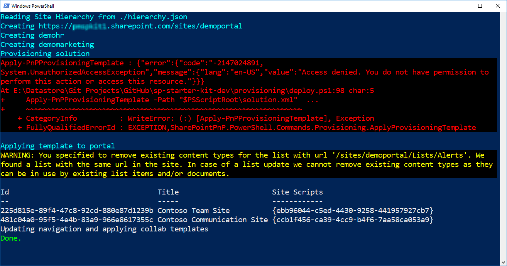

# Common SP Starter Kit Provisioning results

When provisioning SP Starter Kit following the [`deployment process`](../provisioning/readme.md), common outputs including the following.

All examples are based on running the following commands in PowerShell, where `[yourtenant]` is replaced with your specific tenant id.

```powershell
Connect-PnPOnline https://[yourtenant].sharepoint.com
Apply-PnPProvisioningHierarchy -Path starterkit.pnp
```

## Successful provisioning

If all[`pre-requirements`](../#pre-requirements) have been addressed and met, no errors should be generated.


## ERROR: General cascading errors

`Watch the pre-requirements` If you see many cascading errors, most likely a pre-requirement has not been set.

1. Ensure you are connecting to your tenant site using a tenant admin account.

2. Ensure that you have the latest PnP PowerShell commandlets. You might need to remove the PnP PowerShell commandlets and re-install to ensure you have the latest. [`PnP PowerShell - Recommended 3.2.1810.0 or later`](https://github.com/SharePoint/PnP-PowerShell/releases).

3. Your tenant must be set to `targeted release` for all users, and you must wait at least 24 hours after setting targeted release for all users before running deploy.ps1.

4. Verify you have already created your `tenant app catalog`.

4. Verify that the account you are using has Admin rights to the Site Collection for tenant app catalog (eg. /sites/appcatalog)

5. Verify the account you are using to connect to your tenant site has already been added as a term store administrator.

6. If you believe the error is new and not addressed below or in the [`issues list`](https://github.com/SharePoint/sp-starter-kit/issues), please submit a [`new issue`](https://github.com/SharePoint/sp-starter-kit/issues). If the error appears to be an error reported in PowerShell, please enable the PnP Trace Log before running the deploy.ps1 script and report those findings in your new issue.

```powershell
Set-PnPTraceLog -On -Level Debug
```


## ERROR: Inproper version of PnP PowerShell installed

[`PnP PowerShell - Recommended 3.2.1810.0 or later`](https://github.com/SharePoint/PnP-PowerShell/releases) is required for SP Starter Kit to properly provision. It is recommended that you have only the latest version of PnP PowerShell installed on your workstation as well.

If you do not have the proper version of PnP PowerShell installed, you may receive errors similar to:

`Apply-PnPProvisioningHierarchy : The term 'Apply-PnPProvisioningHierarchy' is not recognized as the name of a cmdlet, function, script file, or
operable program. Check the spelling of the name, or if a path was included, verify that the path is correct and try
again. 


### Recommended solution

Verify you have the latest PnP PS commandlets installed, as well as look for competeting, older versions. If you receive any error that references that a given `term` is not `recognized as the name of a cmdlet, function, script file, or
operable program`, you have an issue with how PnP PowerShell is installed on your workstation.

```powershell
Get-Module SharePointPnPPowerShell* -ListAvailable | Select-Object Name,Version | Sort-Object Version -Descending
```


`Update PnP PowerShell'

```powershell
Update-Module SharePointPnPPowerShell*
```

`Remove older verions(s) of PnP PowerShell'

Based on the example above, we can see there are two versions of PnP PS installed. We could remove version  2.23.1802.0 with the following command:

```powershell
Get-InstalledModule -Name "SharePointPnPPowerShellOnline" -RequiredVersion 2.23.1802.0 | Uninstall-Module
```

Alternatively you can decide to uninstall all installed version of PnP PowerShell and reinstall the latest module
```powershell
Uninstall-Module -Name "SharePointPnPPowerShellOnline" -AllVersions
Install-Module -Name "SharePointPnPPowerShellOnline"

## ERROR: App Catalog Required

The SP Starter Kit includes a SPFx solution package, `sharepoint-starter-kit.sppkg`. By default this package will be deployed to the tenant app catalog by the `Apply-PnPProvisioningHierarchy` cmdlet in to your tenant App Catalog.

If you have not completed this task, you might receive an error that includes:

```WARNING: Tenant app catalog doesn't exist. ALM step will be skipped!```



### Recommended solution

[`Create a tenant app catalog`](./manual-deploy-sppkg-solution.md) and wait for deployment to complete, which may take minutes, hours, or possibly a day.

If you provision `sharepoint-starter-kit.sppkg` manually to your tenant app catalog, you may then have the SP Starter Kit deployment script skip the package deployment by utilizing the `-SkipSolutionDeployment` parameter, i.e.

```powershell
.\deploy.ps1 -TenantUrl https://[yourtenant].sharepoint.com -SkipSolutionDeployment
```


## ERROR: Term Set Permissions Required

The deployment script includes a PnP provisioning template that attempts to configure demo terms within the managed metadata service / term store. For this to succeed, the account used to connect to your tenant must have been manually added as a term store administator. If you have not completed this task, you might receive an error that includes:

`Apply-PnPProvisioningHierarchy : Access denied. You do not have permissions to perform this action or access this resource.`



### Recommended solution

Verify that the account you are using to provision SP Starter Kit is a term store administrator.

## ERROR: Not Targeted Release

SP Starter Kit requires that your tenant be set to `Targeted Release` for all users. When the deployment script attempts to provision solution.xml to your tenant, included is an action to upload the included .sppkg SPFx solution to your tenant app catalog as well as approve API permissions. This step fails if you have not properly configured your tenant to `Targeted Release`.

An error may appear similar to the following:

`Apply-PnPProvisioningHierarchy : {"error":{"code":"-2147024891, System.UnauthorizedAccessException","message":"{"lang","en-us","value":"Access denied. You do not have permissions to perform this action or access this resource."}}}`



`This error can also appear if the login account is not an owner of the 'App Catalog' for the tenant

### Invalid App package installation - API Management missing

Deployment of the included SPFx solution `sharepoint-starter-kit.sppkg` may be  [`completed manually`](./manual-deploy-sppkg-solution.md). If you do not have `Targeted Release` enabled for all users, or if you have enabled Targeted Release for all users but have not waited at least 24 hours to full roll out, you may encounter errors when manually deploying the .sppgk package, or attempting to find API Management.

`Manually deploying sharepoint-starter-kit.sppkg`

Although you will be able to upload the SPFx package to the tenant app catalog, an error will be thrown.


`API Management missing`

Without Targeted Release enabled, you will be unable to find `API Management` in the Preview Admin Center.


### Recommended solution

Ensure that your tenant is set to targeted release for all users.

`NOTE:` You will need to wait at least 24 hours after setting your tenant to targeted release before all required updates are provisioned to your tenant before the deploy script will execute correctly.
