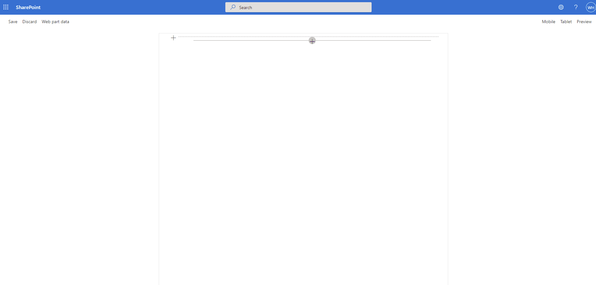

# Personal Calendar web part

This web part provides you the ability to add a particular user's personal calendar on a web page. The web part may be configured to automatically refresh, as well as display up to seven days of events and a pre-defined number of events at a time. This web part is powered by the Microsoft Graph and currently requires that the Office 365 tenant be configured for targeted release for all users.

> `NOTE:` This webpart includes the use of a custom SPFx library, [library-starter-kit-shared](../library-starter-kit-shared). If you need to rebuild / bundle / package this solution, refer to [Minimal Path to Awesome](#Minimal-Path-to-Awesome)



## How to use this web part on your web pages

1. Place the page you want to add this web part to in edit mode.
2. Search for and insert the **Personal Calendar** web part.
3. Configure the web part to update its properties.

## Configurable Properties

The `Personal Calendar` web part can be configured with the following properties:

| Label | Property | Type | Required | Description |
| ---- | ---- | ---- | ---- | ---- |
| Upcoming Events | title | string | no | The web part title, editable inline with the web part itself |
| How often to check for new upcoming meetings (in minutes) | refreshInterval | number | no | Default: 5 - the interval in minutes between auto refresh |
| How many days in advance to retrieve meetings for? 0 - today only | daysInAdvance | number | no | Default: 0 (Today only) - the interval in minutes between auto refresh |
| How many meetings to show? 0 - show all retrieved meetings | numMeetings | number | no | Default: 0 (all) - the interval in minutes between auto refresh |
| Show Calendar | showCalendar | bool | no | Show or hide the calendar component |

## Used SharePoint Framework Version


* Only supported in SharePoint Online due to dependency on the Microsoft Graph APIs

## Applies to

* [SharePoint Framework](https:/dev.office.com/sharepoint)
* [Office 365 tenant](https://dev.office.com/sharepoint/docs/spfx/set-up-your-development-environment)


## Prerequisites

* [library-starter-kit-shared](../library-starter-kit-shared) - this is provided by default in the solution. If you need to rebuild / bundle / package this solution, refer to [Minimal Path to Awesome](#Minimal-Path-to-Awesome)


## Minimal Path to Awesome

This solution uses a SPFx library, [library-starter-kit-shared](../library-starter-kit-shared). As such, additional steps are required to rebuild this project.

1. Clone this entire project
2. Within the [library-starter-kit-shared](../library-starter-kit-shared) source, i.e. [./source/library-starter-kit-shared](../library-starter-kit-shared)
  
  ```powershell
  npm install
  gulp build
  gulp bundle
  npm link
  ```

3. Within this SPFx solution folder [react-personal-calendar](./), i.e. [./source/react-personal-calendar](../react-personal-calendar)
  * in the command line run:
  
  ```powershell
  npm install
  npm link @starter-kit/shared-library
  ```

4. Edit package.json found at the root of the [react-personal-calendar](./), i.e. [./source/react-personal-calendar/package.json](../react-personal-calendar/package.json)

  - Add a new dependancy to the project: "@starter-kit/shared-library": "1.0.0"

  **Example**:

  ```xml
    "dependencies": {
      "@microsoft/mgt-react": "^2.0.0-preview.5",
      ...
      "react": "16.8.5",
      "react-dom": "16.8.5"
    }
  ```

  to:

  ```xml
    "dependencies": {
      "@microsoft/mgt-react": "^2.0.0-preview.5",
      ...
      "react": "16.8.5",
      "react-dom": "16.8.5",
      "@starter-kit/shared-library": "1.0.0"
    }
  ```

5. Within this SPFx solution folder [react-personal-calendar](./), i.e. [./source/react-personal-calendar](../react-personal-calendar)
  
  * in the command line run:
  
  ```powershell
  gulp serve
  ```

6. To rebundle the webpart, within this SPFx solution folder [react-personal-calendar](./), i.e. [./source/react-personal-calendar](../react-personal-calendar)
  * in the command line run:
  
  ```powershell
  gulp bundle
  gulp package-solution
  ```

> If you add this webpart's sppkg to your app catalog, the sppkg for the [shared library](../library-starter-kit-shared) must also be installed. The [library](../library-starter-kit-shared) may be built, bundled, and packaged similar to a standard SPFx webpart or extension.

> The package.json within this SPFx solution file must be manually updated for if the library dependency was included by default with the project, **npm install** would fail as the [library-starter-kit-shared](../library-starter-kit-shared) package would not be found. Linking the two projects allows this webpart to reference the library during **development**, while the package.json reference is required for **bundling and packaging**.


## Features

Description of the web part with possible additional details than in short summary. 
This Web Part illustrates the following concepts on top of the SharePoint Framework:

* Using Microsoft Graph and the Microsoft Graph Toolkit React components within a web part
* Using [SharePoint Framework library components](https://docs.microsoft.com/en-us/sharepoint/dev/spfx/library-component-overview_)
* Hosting SharePoint Framework components as Microsoft Teams tabs
* Using app pages in SharePoint Online


## Solution

Solution|Author(s)
--------|---------
react-personal-calendar | Waldek Mastykarz
react-personal-calendar | Beau Cameron


## Version history

Version|Date|Comments
-------|----|--------
1.0|May, 2018|Initial release
2.0|November 29,2019|v2.0
2.1|November 2020|Include Microsoft Graph Toolkit React components

## Disclaimer

**THIS CODE IS PROVIDED *AS IS* WITHOUT WARRANTY OF ANY KIND, EITHER EXPRESS OR IMPLIED, INCLUDING ANY IMPLIED WARRANTIES OF FITNESS FOR A PARTICULAR PURPOSE, MERCHANTABILITY, OR NON-INFRINGEMENT.**

---

